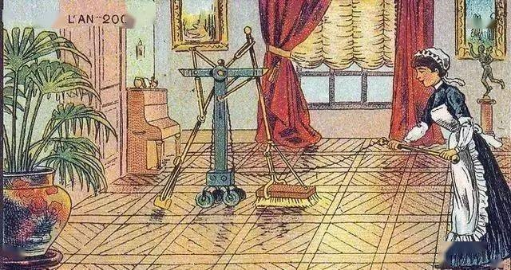
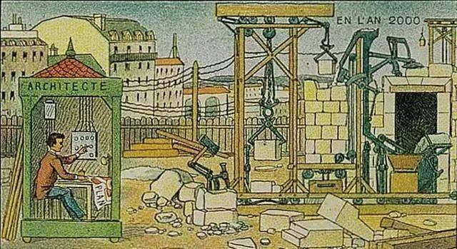

#关于AI的畅想
作者：李昭阳

##Al闯进大众视野
&ensp;&ensp;&ensp;
1926年12月8日的清晨，一切都和往常一样，人们洗漱、进餐、赶赴工厂。车流暂滞，一位穿着绅士的先生从伸进车窗的报童小手中买下了《密尔沃基日报前哨》，只见那新闻标题赫然:“幻影汽车将自主探索城市”。绅士只是笑笑，心想:“真是新颖的观点啊”，随即踩下离合、推上排挡，驱车离开。
 
&ensp;&ensp;&ensp;
当“自动驾驶”这个划时代的概念出现在一封地方性的日报上时，其重大意义被局限在人们无趣时光的消遣、茶余饭后的谈资之中。在那个计算机尚未出现的年代，自动驾驶汽车被设计成无线电遥控驾驶的模式——驾驶员通常会坐在不远处控制“幻影汽车”，这虽然与当代理念大相径庭，但对于那个年代来说，出现如此前瞻的概念已经是难能可贵的了。
 
&ensp;&ensp;&ensp;
随着1946年电子计算机的诞生，在1950年前后渐渐出现了汽车自动化的实验。经历无数次测试，第一台真正意义上的自动化汽车生产于上世纪八十年代。此后实验的进程越来越快，2012年美国内华达州机动车辆管理局为谷歌自动驾驶汽车颁发了合法车牌；2018年底，Waymo公司将自动驾驶汽车推入市场，正式开始其商业化--在经历了百年漫长的研发过程后，自动驾驶终于冠以人工智能的名义，在润物无声中渐入人们的生活。自此，自动驾驶与每个人息息相关。
 
&ensp;&ensp;&ensp;
当代自动驾驶与人工智能的联系紧密。自动驾驶汽车一方面具备准确探测外界的信息的能力，可以在各类传感器的翻助下，收集车辆运行的数据，通过中央处理器处理并迅速做出调整；另一方面，与众多人工智能领域专家的观点一致，自动驾驶汽车具备深度学习能力。在对海量数据的分析与处理后，汽车将收集到的图象、波等直观信息转化为对其有价值的数据。经过深度学习，汽车识别道路、行人、障碍物的效率和准确性均得到了明显提高。 
 
&ensp;&ensp;&ensp;
自动驾驶依然有很大的提升空间。除了检测和避开行人之外，自动驾驶汽车还应当可以通过推断精神状态而更准确地预测行人和其他司机的行为(例如通过判断他们是否在注意车流来增减车速)。这种类型的心理推理，以及其他类型的基于模型的因果和物理推理，对于缺乏相关培训数据的新颖驾驶环境很有价值[1](#refer-anchor-1)。
 
&ensp;&ensp;&ensp;
比起尚未占据主流的自动驾驶技术，脸部辨识技术已经在真正意义上深入了大众的生活，从手机的面容解锁到支付宝的“刷脸”支付:从住宅小区门口的“刷脸”门禁到全国范围的嫌犯排查。可以说，人工智能对于人脸的识别已经成为了每个人生活不可或缺的一部分。
 
&ensp;&ensp;&ensp;
虽然人脸识别的突然兴起发生在最近五年，但其历史可以追洲到1888年，《自然》杂志发表了法兰西斯·高尔顿的一篇代表性的论文，介绍如何使用人的面部特征进行识别。近现代传统的人脸识别技术大致分为五个方法:基于模板匹配的方法；基于几何特征的方法；基于代数特征的方法；基于人工神经网络的方法；基于稀疏表示的方法。但随着人工智能的不断发展，人脸识别技术也产生了基于深度学习的方法。相较于传统，新的方法基于对大量人脸数据集的学习，大大提高了识别的速度与精确度。
 
&ensp;&ensp;&ensp;
或许我们不难发现，人工智能的发展总是趋向于摒弃原有的程序算法，使计算机自主学习处理数据、脸部识别技术的实现，展现了弱人工智能向强人工智能的转化，处处体现着人工智能的美学--高效、便利、精准、强大。
 
&ensp;&ensp;&ensp;
对于笔者而言，脸都识别技术的出现使得我们的生活效率和生活质量显著提高--在生活节奏不断加快的今天，有什么能比不用扫码就可以买到一罐廉价的饮品更能让人欣慰的呢?

##AI渐入群众内心

###**AI早在梦里**

&ensp;&ensp;&ensp;
在人类文明的初始阶段，远远早于“人工智能”这个词汇被正式提出之时，出于对神权的敬仰和对于未知的想象，中外均已出现了类AI的思想。我国春秋时期名著《列子·汤问》中的《偃师献伎》有记载——偃师向王进献一具木偶，虽然木偶看上去在被偃师控制，但实际上有自己的意识。与《列子》几乎同期，古罗马诗人奥维德在《变形记》中也有相似的思想体现：塞浦路斯国王皮格马利翁以自己想象中的理想女性为模板，亲手制作了一个象牙雕塑并起名为伽拉忒亚，随后国王便爱上了她，爱神维纳斯出于对国王的同情，赋予这件雕塑生命。不难看出，在人类文明的萌芽阶段，AI的概念仅仅停留在想象中——即以形而上的方式将生命赋予非生物。
 
&ensp;&ensp;&ensp;
数千年白驹过隙，1900年的画家们畅想100年后的世界，创作了一系列展示在烟盒、明信片等上的插画——小到家庭扫地机器人，大到建筑机器人[2](#refer-anchor-2)。此时，人们对于类AI的思考已经不再是“赋予生命”，更多在关注其实用价值。

 
&ensp;&ensp;&ensp;
时间来到1950年，艾伦·图灵发表了题为《机器能思考吗？》的论文并在其中提出了图灵测试和机器思维的概念，现代意义上的人工智能出现萌芽。六年后，达特茅斯会议如期召开，约翰·麦肯锡将世界志同道合的科学家聚集在一起集思广益。会议期间，人工智能的概念被暂时统一——“人工智能就是要让机器的行为看起来就像是人所表现出的智能行为一样。” 
 
&ensp;&ensp;&ensp;
19世纪60年代，由于人工神经网络的突破，群众和政府对人工智能的未来大为看好，人工智能进入了第一个蓬勃发展的时期。但随着1969年马文·明斯基出版的《感知机》提出了人工神经网络的局限，人们对于人工智能的乐观期望遭到了严重打击，人工智能的研究迎来第一次低谷。
 
&ensp;&ensp;&ensp;
上世纪八十年代，一类名为“专家系统”的AI程序成功模拟了人的知识分析技能，人们开始希望制造出能够与人交流、翻译文字、分析图像甚至像人一样推理的机器，群众眼中的人工智能再一次变得无所不能。但在1987年，技术的发展难以达到用户的期待，Lisp机器市场崩溃，人工智能领域声誉再次下降，人们再次失望，第二次凛冬降临。
 
&ensp;&ensp;&ensp;
2006年，杰弗里·辛顿提出了神经网络深度学习算法，显著提高了神经网络的能力，也丰富了人工智能的概念——人工智能应当具备学习的能力。自此，人工智能重获人们信赖，迎来了第三次高峰。时至今日，人工智能成为了人们心中最为前沿、最具潜力的“新兴”行业。

###**AI仍在路上**

&ensp;&ensp;&ensp;
事实上，当下的AI并非尽善尽美。
 
&ensp;&ensp;&ensp;
人们比机器更善于解决一系列困难的问题，包括场景理解、概念学习、语言学习、语音识别、语言理解等。而创造力、常识和通用推理等人类的认知能力对于机器仍然难以理解。未来几年有望在自动驾驶汽车、遗传学、医药、药物设计和机器人等领域推出更多人工智能应用[1](#refer-anchor-1)。
 
&ensp;&ensp;&ensp;
在当前备受关注的神经网络方面，未来几代的神经网络将看起来与目前的最先进的神经网络大相径庭。他们可能被赋予直观的物理、因果推理、心智理论和其他能力[3](#refer-anchor-3)。 
 
&ensp;&ensp;&ensp;
业界权威人士在其著作中总是一副严肃的面孔，为此，笔者采访了清华大学信息学院副院长、自动化系主任张涛教授，希望可以用一种轻松的方式表现他对人工智能的看法。

####阿西莫夫在小说中对人工智能机器人有三大原则，现实编译人工智能机器人的自我学习功能时，是否有这三大原则的约束呢？

&ensp;&ensp;&ensp;
比如说伤害人，技术上机器当下是无法自我学习到的，我们现在还是弱人工智能，你让它有攻击人类的行为，那肯定是人教的。这个问题就像法律和道德一样，法律由公安机关来执行，道德是靠大家自觉遵守。三原则现在只是道德道义上的，暂时没有什么约束的方法，但至今大家还都认可这些原则。
 

####《终结者》等电影中人工智能突破了人类权限的限制，接管了世界的统治。那么请问您对这类观点有何看法呢？

&ensp;&ensp;&ensp;
人类肯定是希望人工智能可以帮助人类做一些事情，而不是让它危害人类。将来如果出现这种危害人类的人工智能之后，大家肯定有办法把它控制住，这是矛和盾的关系。

####人工智能这个概念已经提出了七十年左右，但近些年人工智能突然经历第三次兴起，您认为是偶然现象还是大势所趋？

&ensp;&ensp;&ensp;
我觉得它就是一个不断的在发展、在进步的过程，每一个科学门类都是这样起起伏伏的，这是很自然的事情。如果有新的突破了就成为潮流，一直没有什么突破大家就不关注了。这次人工智能热主要是由AlphaGo打败了围棋世界冠军引起的，它兴起就是由于深度学习算法的提出——深度学习能够很好的解决这个棋局，后来又解决了很多计算机视觉等等的问题。

####您觉得人工智能会不会迎来它的这种第三次寒冬呢？

&ensp;&ensp;&ensp;
这个绝对有可能，如果这个行业持续没有什么新发展的话，可能公众关注的就会变少，大家转而去关注别的了，这是有可能的，但当下我对人工智能这个领域还是非常看好的，觉得很有前景。不好说第三次寒冬会因什么而起，可能只有科幻小说家会猜这个。

####您对人工智能有什么展望？

&ensp;&ensp;&ensp;
人工智能未来发展肯定越来越强的。现在确实很难预见人工智能后面会有什么样的突破，但是任何的突破都有可能。我觉得无论是具有更高形态的实体、突破算法限制形成思维、人与人工智能融合等等，我们都可以大胆地、尽情地去想象。人工智能从它的定义来讲就是要模拟人类的智能，初衷就是希望能够用机器来帮助人，所以我觉得各种各样的可能都会出现。

 
&ensp;&ensp;&ensp;
同张教授所言，当下的人工智能还在路上、未来的人工智能无限可能。“俱往矣，数风流人物，还看今朝”，笔者愿寄希望于未来--征途不止，畅想无极!

##参考文献

- [1] Brenden M. Lake et al. Building machines that learn and think like people[J]. Behavioral and Brain Sciences, 2016, 40

- [2] [100年前插画师幻想的未来世界是什么样的？这些插画告诉你 ](https://www.sohu.com/a/453821546_99947083)

- [3] Jing Pei et al. Towards artificial general intelligence with hybrid Tianjic chip architecture[J]. Nature: International weekly journal of science, 2019, 572(7767) : 106-111.
