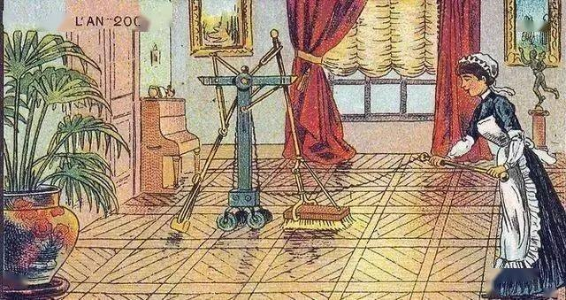
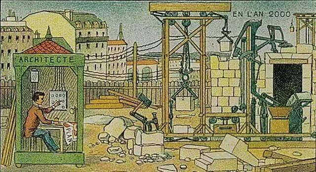

#关于AI的畅想
###**作者：李昭阳**

&ensp;&ensp;&ensp;
谈到人工智能，人们的第一印象大多数来源于有关人工智能的书籍、电影、纪录片。《终结者》是笔者最早接触的一部人工智能影片。作为经典的“人工智能威胁论”影片，《终结者》讲述的是在未来超人工智能脱离人类控制、接管世界统治的背景下，超人工智能为剿灭人类反抗组织，派遣机器人杀手回到二十年前杀死反抗组织领袖的科幻故事。
 
&ensp;&ensp;&ensp;
在影片中，人类与人工智能的矛盾被表现的淋漓尽致——脱离控制、无所不能、攻击人类……无不反映着大众对超人工智能未知的恐惧。这类畅想并不易让人感到诧异——比著名的芯片摩尔定律更迅猛，人工智能进步的速度之快足以令人产生焦虑。人工智能威胁论与英国物理学家史蒂芬·霍金的观点是吻合的，即“人工智能有可能是人类历史上最后的事件”。
 
&ensp;&ensp;&ensp;
与人工智能威胁论相对，在另一部分人的畅想中，人工智能则是人类的得力助手——《星际穿越》中刻画了三个智能机器人，以其中的Tars为例，在科幻的故事背景下，它不仅可以操控飞船，还在尽力保护人类的生命和利益——即使掉进黑洞也收集整理了重要数据，使得人类取得了重力方面的重大突破。关于人工智能有益的畅想也有忠实支持者——谷歌等互联网公司的主要技术人员大部分都认同人工智能有益的观点。
 
&ensp;&ensp;&ensp;
就电影本身而言，以上两部影片对人工智能的演绎均存在一些片面——《终结者》通过华丽的特效，将人工智能刻画成最便于演绎的机器人的形象——天崩地裂、靛光掣目、迷雾扑朔、外形与人类完全一致的终结者在机械传动轴的运作声中缓缓站起；《星际穿越》虽然避免了为人工智能赋予“人类外形”，但终究还是以机器人的形式进行了表现。这在一定程度上使得部分人形成了刻板偏见——人工智能等价于机器人。
 
&ensp;&ensp;&ensp;
实际上，机器人仅仅是人工智能的一种形式。同样的，电影也仅仅是人们对人工智能的一种畅想方式——漫漫历史长河中从不缺乏仰望星空的人。

##畅想未曾止步
&ensp;&ensp;&ensp;
在人类文明的初始阶段，远远早于“人工智能”这个词汇被正式提出之时，出于对神权的敬仰和对于未知的想象，中外均已出现了类AI的思想。我国春秋时期名著《列子·汤问》中的《偃师献伎》有记载——偃师向王进献一具木偶，虽然木偶看上去在被偃师控制，但实际上有自己的意识。与《列子》几乎同期，古罗马诗人奥维德在《变形记》中也有相似的思想体现：塞浦路斯国王皮格马利翁以自己想象中的理想女性为模板，亲手制作了一个象牙雕塑并起名为伽拉忒亚，随后国王便爱上了她，爱神维纳斯出于对国王的同情，赋予这件雕塑生命。不难看出，在人类文明的萌芽阶段，AI的概念仅仅停留在想象中——即以形而上的方式将生命赋予非生物。
 
&ensp;&ensp;&ensp;
数千年白驹过隙，1900年的画家们畅想100年后的世界，创作了一系列展示在烟盒、明信片等上的插画——小到家庭扫地机器人，大到建筑机器人[1](#refer-anchor-1)。此时，人们对于类AI的畅想已经不局限于“赋予生命”，更多在关注其实用价值。
 

 
&ensp;&ensp;&ensp;
时间来到1926年12月8日的清晨，一切都和往常一样，人们洗漱、进餐、赶赴工厂。车流暂滞，一位穿着绅士的先生从伸进车窗的报童小手中买下了《密尔沃基日报前哨》，只见那新闻标题赫然:“幻影汽车将自主探索城市”。绅士只是笑笑，心想:“真是新颖的观点啊”，随即踩下离合、推上排挡，驱车离开。当“自动驾驶”这个划时代的概念出现在一封地方性的日报上时，其重大意义被局限在人们无趣时光的消遣、茶余饭后的谈资之中。但在那个人工智能尚未被定义的年代，出现如此前瞻的概念已经是难能可贵的了。
 
&ensp;&ensp;&ensp;
文学家一直在思考与人工智能的伦理关系——阿西莫夫在1942年出版的著作《环舞》中提出了著名的机器人三定律：“机器人不得伤害人类个体，或者目睹人类个体将遭受危险而袖手不管；机器人必须服从人给予它的命令，当该命令与第一定律冲突时例外；机器人在不违反第一、第二定律的情况下要尽可能保护自己的生存”。事实上，这三大定律成为了后世众多经典科幻电影的矛盾源头——机器人突破了三大定律开始攻击人类。
 
&ensp;&ensp;&ensp;
因此，与《终结者》类似，人类与人工智能的冲突一直是影视剧本的高热度话题。同时我们不难发现，这个话题在人工智能萌芽期和低谷期尤为热门——1964年上映的《2001：太空漫游》中机器人通过谋杀人类保证自己的任务顺利完成；1977年上映的《星球大战》中所描述的战争机器人危害到了全人类的生命安全；1999年上映的《黑客帝国》中所描述的人们被禁锢在虚拟现实中；机器人“造反”的主题在2004年上映的《我，机器人》当中表现的更加典型——机器人突破并曲解了三定律，冠以“为了人类未来发展”的名义去统治人类。
 
&ensp;&ensp;&ensp;
不难猜测，与威胁论相对，有关人工智能有益论的作品在人工智能逐渐回暖和大显身手的时期出现尤为高频——上世纪六十年代的《阿童木》、八十年代的《霹雳五号》、21世纪初的《人工智能》等无不表现了人工智能与人类友好相处的和谐画面。
 
&ensp;&ensp;&ensp;
比起电影、电视剧、动画片，当下的纪录片或许能够更加具体地反映人工智能的真实形态。《AlphaGo》从一个人工智能团队研发深度学习机器人以挑战人类顶级大师的角度，最真实地反映了人工智能开发、训练的过程；《探寻人工智能》则从现实层面出发，记录了一个又一个已经实现的人工智能，思考一个又一个新诞生的人机矛盾……或许从这些作品中，我们可以认识到那些已经走近了身边的人工智能，进而从已经实现的畅想中生发出更多的畅想。
##畅想日新月异
&ensp;&ensp;&ensp;
不同于文学家们通过其作品中丰富的人物形象表达自己对AI的畅想，在近现代人工智能发展的过程中，科学家们的畅想则是通过极致追求人工智能的实践来表现。
 
&ensp;&ensp;&ensp;
1950年，艾伦·图灵发表了题为《机器能思考吗？》的论文并在其中提出了图灵测试和机器思维的概念，将现代意义上对人工智能的畅想以论著的形式表现了出来。
 
&ensp;&ensp;&ensp;
六年后，达特茅斯会议如期召开，约翰·麦肯锡将世界志同道合的科学家聚集在一起集思广益。会议期间，人工智能的概念被暂时统一——“人工智能就是要让机器的行为看起来就像是人所表现出的智能行为一样。”
 
&ensp;&ensp;&ensp;
19世纪60年代，由于人工神经网络的突破，人们开始憧憬神经网络可以解决大量的算法函数逼近和逻辑策略问题。人们对人工智能的未来大为看好，人工智能进入了第一个蓬勃发展的时期。但随着1969年马文·明斯基出版的《感知机》提出了人工神经网络的局限（即不能解决高阶谓词等问题），人们对于人工智能的乐观期望遭到了严重打击，人工智能的研究迎来第一次低谷。
 
&ensp;&ensp;&ensp;
低谷时期的人工智能技术发展很艰难，但是科学家们一直保留着有想法便要尽力付诸实践的品质。上世纪八十年代，一类名为“专家系统”的AI程序成功模拟了人的知识分析技能，与当时人们想象中的完美人工智能（能够与人交流、翻译文字、分析图像甚至像人一样推理）恰好方向一致，人们眼中的人工智能再一次变得无所不能。但正如约翰·麦肯锡的名言：“一旦它开始发挥作用,就不会再有人叫它人工智能了”，在1987年，随着用户的期待不断提高，技术的发展难以满足用户的要求，Lisp机器市场崩溃，人工智能领域声誉再次下降，第二次凛冬降临。
 
&ensp;&ensp;&ensp;
在这次人工智能寒冬中，科学家们将思想的洪流回溯到人工神经网络，尝试着去突破明斯基所预言的人工神经网络的局限。2006年，杰弗里·辛顿提出了神经网络深度学习算法，显著提高了神经网络的能力，也丰富了人工智能的概念——人工智能应当具备学习的能力。自此，人工智能重获人们信赖，迎来了第三次高峰。时至今日，人工智能成为了人们心中最为前沿、最具潜力的“新兴”行业。
##畅想不羁一隅
&ensp;&ensp;&ensp;
人工智能作为当下最热门的行业，自然吸引了大批的关注。难以想象人工智能将会有多么广阔的未来，所以在这个时代，所有人都有权利继续畅想下去。笔者与不同年龄阶段、不同知识储备程度的朋友们深入座谈交流、收集调查问卷，同时一并阅读了部分文献，得到了许多有价值的观点。
 
&ensp;&ensp;&ensp;
对于大部分少年儿童而言，由于受到科幻小说、影视作品的影响，他们对于人工智能的理解是停留在想象阶段的，人工智能对于他们而言更多是想象中的那些可以成为朋友的机器人——类似于日本动漫中“哆啦A梦”的形象。
 
&ensp;&ensp;&ensp;
作为青年学生，在接触了有关程序设计和人工智能的课程之后，相较于孩童执着AI的科幻成分，同学们更多地关注了自己畅想的可实现性。对“你想象中的未来人工智能”问题搜集的有效问卷样本进行分析后，大致可以将观点划分为三大类——形成自主思维、大幅提升服务业质量、未知环境探索。
 
&ensp;&ensp;&ensp;
形成自主思维的观点中，大部分人认为，未来的人工智能应该可以辅助解决更多高难度的数理分析、战略统筹决策问题、产生审美、情感等抽象类功能、基于一定的数据分析预测尚未发生的事件；由于当下人工智能虽然功能多样化，但质量并不能达到令所有人满意的程度，所以有关提升服务业质量的样本问卷中，“精准医疗”、“工作助理”、“生活管家”、“智能家具”的高智能化被提到的频率最高，“感同身受的虚拟现实”、“人机结合交互”等也是值得思考的方向；对于未知环境的探索方面，人们对火灾、地震等的救援很感兴趣，也有人提出了以人工智能作为太空、深海探索先锋的观点。除此三大类观点外，“人机界面完善”、“机器人趋向小型化”也是有参考意义的畅想。
 
&ensp;&ensp;&ensp;
同时，问卷中对“人工智能有益有害”的思考方面，74.29%的人认为人工智能不会失控；对“未来AI专一化和集成化”的讨论中，57.14%的人认为专一化（即机器仅可以高质量地实现单一功能）相较于集成化（即质量较低地实现多种功能）更具优势。
 
&ensp;&ensp;&ensp;
科学家们在著作中也对当下并非尽善尽美的AI提出了很多优化性的畅想——人们比机器更善于解决一系列困难的问题，包括场景理解、概念学习、语言学习、语音识别、语言理解等。而创造力、常识和通用推理等人类的认知能力对于机器仍然难以理解。未来几年有望在自动驾驶汽车、遗传学、医药、药物设计和机器人等领域推出更多人工智能应用[2](#refer-anchor-2)。在当前备受关注的神经网络方面，未来几代的神经网络将看起来与目前的最先进的神经网络大相径庭。他们可能被赋予直观的物理、因果推理、心智理论和其他能力[3](#refer-anchor-3)。 
 
&ensp;&ensp;&ensp;
业界权威人士在其著作中总是一副严肃的面孔，为此，笔者采访了清华大学自动化系主任张涛教授，希望可以用一种轻松的方式表现他对人工智能的畅想。

####阿西莫夫在小说中对人工智能机器人有三大原则，现实编译人工智能机器人的自我学习功能时，是否有这三大原则的约束呢？

&ensp;&ensp;&ensp;
比如说伤害人，技术上机器当下是无法自我学习到的，我们现在还是弱人工智能，它有攻击人类的行为，那肯定是人教的。这个问题就像法律和道德一样，法律由公安机关来执行，道德是靠大家自觉遵守。三原则现在只是道德道义上的，暂时没有什么约束的方法，但至今大家还都认可这些原则。
 

####《终结者》等电影中人工智能突破了人类权限的限制，接管了世界的统治。那么请问您对这类观点有何看法呢？

&ensp;&ensp;&ensp;
人类肯定是希望人工智能可以帮助人类做一些事情，而不是让它危害人类。将来如果出现这种危害人类的人工智能之后，大家肯定有办法把它控制住，这是矛和盾的关系。

####您对人工智能还有什么畅想？

&ensp;&ensp;&ensp;
人工智能未来发展肯定越来越强的。现在确实很难预见人工智能后面会有什么样的突破，但是任何的突破都有可能。我觉得无论是具有更高形态的实体、突破算法限制形成思维、人与人工智能融合等等，我们都可以大胆地、尽情地去想象。人工智能从它的定义来讲就是要模拟人类的智能，初衷就是希望能够用机器来帮助人，所以我觉得各种各样的可能都会出现。
##畅想何去何从
&ensp;&ensp;&ensp;
《终结者》在反派机器人被液压机碾碎的结局中落下帷幕，仿佛表明人机最终难免沦为仇敌，但似乎这种不切实际的幻想并不能对社会做出实质性的贡献。事实上，在《终结者》中更有很多渐渐被付诸实践的畅想，这当中最主要的是学习能力的体现——终结者刚刚降临时并不能与人类进行语言交流，但它依靠后期的机器学习得到了与他人交流的能力。这类畅想对于当下这个已经诞生过“AlphaGo”等深度学习机器的时代并不是新鲜之事，但对于1984年而言，那个时代的畅想真的在最后被付诸了实践。与《终结者》有相似之处，对于《星际穿越》，Tars试图实现的“幽默”功能正是当下人工智能领域竭力解决的“机器情感”难题，但我们可以相信最终有一天这个难题会被攻克。
 
&ensp;&ensp;&ensp;
由此我们不难发现，比起跌宕起伏的故事情节，人工智能科幻作品中暗含的畅想更是应该加以关注的方面——《2001：太空漫游》率先提出了人机交互的计算机概念（或许启发了当下的小艺、Siri等语音助手）；《王牌特派员》准确预测了在线购物、在线游戏等现代社会场景；《黑镜》当中的AI虚拟人、微型机器人也是当下亟待实现的技术……可以说，相关的文学作品有很强的前瞻性，这当中的畅想或许可以成为人们未来努力实践的方向。
 
&ensp;&ensp;&ensp;
所有畅想都应该归于实践——皮格马利翁的伽拉忒亚对应着如今的“AI女友”、偃师的木偶变成了当下“自动机器人”、扫地机器人以全新面貌进入千家万户、建筑机器人在水泥森林中崭露头角……历史长河中从不缺乏仰望星空的浪漫主义者，更不缺乏埋头苦干的实干主义家——无论是跨越千年还是遥隔万里，美好的畅想终究要实现。
 
&ensp;&ensp;&ensp;
正如张教授所言，当下的人工智能还在路上、未来的人工智能无限可能。畅想之瀚海无限，实践之天路同样长远，“俱往矣，数风流人物，还看今朝”，笔者愿寄希望于未来——征途不止，畅想无极!
##参考文献

- [1] [100年前插画师幻想的未来世界是什么样的？这些插画告诉你 ](https://www.sohu.com/a/453821546_99947083)

- [2] Brenden M. Lake et al. Building machines that learn and think like people[J]. Behavioral and Brain Sciences, 2016, 40

- [3] Jing Pei et al. Towards artificial general intelligence with hybrid Tianjic chip architecture[J]. Nature: International weekly journal of science, 2019, 572(7767) : 106-111.

